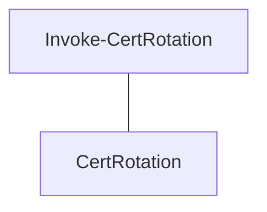

<!-- GENERATED by docs-warden - do not edit -->

# Domain model

Generated by `domain_model.py` from 105 source file(s) (python, javascript, powershell). Categories come
from a naming heuristic (`references/concept-categories.md`); a concept in the wrong table is
fixed by renaming it in code or listing it under `ontology.overrides:` in `.docs-warden.yml`,
never by editing this file.

## Domain concepts

| Concept | Kind | Defined in | Summary | Documented in |
|---------|------|------------|---------|---------------|
| CertRotation | noun | `plugins/docs-warden/test/fixtures/repo-it-tooling/src/CertRotate.psm1:2` |  |  |
| Ontology | class | `plugins/docs-warden/skills/ontological-documentation/scripts/extract_concepts.py:84` | Concepts and candidate edges. Edges are filtered at the end, not as they |  |

## Technical concepts

| Concept | Kind | Defined in |
|---------|------|------------|
| Invoke-CertRotation | function | `plugins/docs-warden/test/fixtures/repo-it-tooling/src/CertRotate.psm1:2` |
| ResolutionError | class | `plugins/fabflows/evals/fixtures/dep-resolver/reference/src/index.js:184` |
| _accepted_record_edited_after_acceptance | function | `plugins/docs-warden/test/test_scripts.py:1131` |
| _artifact_label | function | `plugins/docs-warden/skills/docs-warden/scripts/audit.py:977` |
| _artifact_paths | function | `plugins/docs-warden/test/test_scripts.py:377` |
| _artifact_present | function | `plugins/docs-warden/skills/docs-warden/scripts/audit.py:968` |
| _artifact_satisfied | function | `plugins/docs-warden/skills/docs-warden/scripts/audit.py:982` |
| _audit_check | function | `plugins/docs-warden/test/test_scripts.py:97` |
| _audit_row | function | `plugins/docs-warden/test/test_scripts.py:2036` |
| _candidate_files | function | `plugins/docs-warden/skills/ontological-documentation/scripts/extract_concepts.py:300` |
| _cell | function | `plugins/docs-warden/skills/ontological-documentation/scripts/domain_model.py:87` |
| _compact | function | `plugins/docs-warden/test/test_scripts.py:1853` |
| _decisions_repo | function | `plugins/docs-warden/test/test_scripts.py:1832` |
| _documentation_files | function | `plugins/docs-warden/skills/docs-warden/scripts/audit.py:645` |
| _domain_model | function | `plugins/docs-warden/test/test_scripts.py:2340` |
| _extract | function | `plugins/docs-warden/test/test_scripts.py:2283` |
| _first_line | function | `plugins/docs-warden/skills/ontological-documentation/scripts/extract_concepts.py:65` |
| _full_card | function | `plugins/docs-warden/test/test_scripts.py:707` |
| _grow | function | `plugins/docs-warden/test/test_scripts.py:1922` |
| _has_edge | function | `plugins/docs-warden/test/test_scripts.py:2291` |
| _import_audit | function | `plugins/docs-warden/test/test_scripts.py:1752` |
| _is_example_asset | function | `plugins/docs-warden/skills/docs-warden/scripts/audit.py:658` |
| _js | function | `plugins/docs-warden/skills/ontological-documentation/scripts/extract_concepts.py:166` |
| _line_of | function | `plugins/docs-warden/skills/ontological-documentation/scripts/extract_concepts.py:162` |
| _link_dir | function | `plugins/docs-warden/test/test_scripts.py:2184` |
| _lint_entry | function | `plugins/docs-warden/test/test_scripts.py:1377` |
| _lint_runner | function | `plugins/docs-warden/skills/docs-warden/scripts/audit.py:769` |
| _make_unreadable | function | `plugins/docs-warden/test/test_scripts.py:785` |
| _names | function | `plugins/docs-warden/skills/ontological-documentation/scripts/extract_concepts.py:194` |
| _node | function | `plugins/docs-warden/skills/ontological-documentation/scripts/domain_model.py:91` |
| _one_check | function | `plugins/docs-warden/test/test_scripts.py:88` |
| _only_note | function | `plugins/docs-warden/skills/docs-warden/scripts/audit.py:92` |
| _ontology_audit_repo | function | `plugins/docs-warden/test/test_scripts.py:2388` |
| _ontology_repo | function | `plugins/docs-warden/test/test_scripts.py:2256` |
| _param_candidates | function | `plugins/docs-warden/skills/ontological-documentation/scripts/extract_concepts.py:75` |
| _powershell | function | `plugins/docs-warden/skills/ontological-documentation/scripts/extract_concepts.py:217` |
| _ps_synopsis | function | `plugins/docs-warden/skills/ontological-documentation/scripts/extract_concepts.py:208` |
| _python | function | `plugins/docs-warden/skills/ontological-documentation/scripts/extract_concepts.py:124` |
| _regulated_repo | function | `plugins/docs-warden/test/test_scripts.py:1082` |
| _relative_link_targets | function | `plugins/docs-warden/skills/docs-warden/scripts/audit.py:663` |
| _resolve_standard | function | `plugins/docs-warden/skills/docs-warden/scripts/audit.py:1004` |
| _rule_qms_record | function | `plugins/docs-warden/skills/docs-warden/scripts/audit.py:909` |
| _rule_trace_requirements | function | `plugins/docs-warden/skills/docs-warden/scripts/audit.py:933` |
| _runlog_warnings | function | `plugins/docs-warden/test/test_scripts.py:251` |
| _shown | function | `plugins/docs-warden/skills/docs-warden/scripts/audit.py:507` |
| _snake_to_pascal | function | `plugins/docs-warden/skills/ontological-documentation/scripts/extract_concepts.py:71` |
| _standards_entries | function | `plugins/docs-warden/test/test_scripts.py:1525` |
| _standards_entry | function | `plugins/docs-warden/test/test_scripts.py:1543` |
| _standards_label | function | `plugins/docs-warden/skills/docs-warden/scripts/audit.py:1237` |
| _table | function | `plugins/docs-warden/test/test_scripts.py:367` |
| _terraform | function | `plugins/docs-warden/skills/ontological-documentation/scripts/extract_concepts.py:262` |
| _terraform_edges | function | `plugins/docs-warden/skills/ontological-documentation/scripts/extract_concepts.py:282` |
| _tf_body | function | `plugins/docs-warden/skills/ontological-documentation/scripts/extract_concepts.py:247` |
| _universal_repo | function | `plugins/docs-warden/test/test_scripts.py:143` |
| _unread_note | function | `plugins/docs-warden/skills/docs-warden/scripts/audit.py:97` |
| _waivable | function | `plugins/docs-warden/skills/docs-warden/scripts/audit.py:120` |
| _waive | function | `plugins/docs-warden/skills/docs-warden/scripts/audit.py:1212` |
| adr_files | function | `plugins/docs-warden/skills/docs-warden/scripts/_common.py:245` |
| apply_overrides | function | `plugins/docs-warden/skills/ontological-documentation/scripts/domain_model.py:72` |
| audit | function | `plugins/docs-warden/skills/docs-warden/scripts/audit.py:1178` |
| build | function | `plugins/docs-warden/skills/ontological-documentation/scripts/domain_model.py:144` |
| canonical | function | `plugins/docs-warden/skills/docs-warden/scripts/trace_matrix.py:42` |
| categorise | function | `plugins/docs-warden/skills/ontological-documentation/scripts/extract_concepts.py:55` |
| check | function | `plugins/docs-warden/skills/docs-warden/scripts/audit.py:84` |
| check_adr_immutability | function | `plugins/docs-warden/skills/docs-warden/scripts/audit.py:324` |
| check_adr_index | function | `plugins/docs-warden/skills/docs-warden/scripts/audit.py:424` |
| check_front_matter | function | `plugins/docs-warden/skills/docs-warden/scripts/audit.py:263` |
| check_generated_docs | function | `plugins/docs-warden/skills/docs-warden/scripts/audit.py:519` |
| check_glossary_reject_terms | function | `plugins/docs-warden/skills/docs-warden/scripts/audit.py:834` |
| check_line | function | `plugins/docs-warden/skills/docs-warden/scripts/adr_compact.py:93` |
| check_links | function | `plugins/docs-warden/skills/docs-warden/scripts/audit.py:677` |
| check_lint | function | `plugins/docs-warden/skills/docs-warden/scripts/audit.py:785` |
| check_manifest | function | `plugins/docs-warden/skills/docs-warden/scripts/audit.py:144` |
| check_ontology | function | `plugins/docs-warden/skills/docs-warden/scripts/audit.py:441` |
| check_phi_secrets | function | `plugins/docs-warden/skills/docs-warden/scripts/audit.py:881` |
| check_readme_shape | function | `plugins/docs-warden/skills/docs-warden/scripts/audit.py:1111` |
| check_required_files | function | `plugins/docs-warden/skills/docs-warden/scripts/audit.py:210` |
| check_standards | function | `plugins/docs-warden/skills/docs-warden/scripts/audit.py:1037` |
| documented_in | function | `plugins/docs-warden/skills/ontological-documentation/scripts/domain_model.py:48` |
| extract | function | `plugins/docs-warden/skills/ontological-documentation/scripts/extract_concepts.py:325` |
| git | function | `plugins/docs-warden/skills/docs-warden/scripts/_common.py:285` |
| is_git_repo | function | `plugins/docs-warden/skills/docs-warden/scripts/_common.py:303` |
| is_test | function | `plugins/docs-warden/skills/docs-warden/scripts/trace_matrix.py:54` |
| last_commit_epoch | function | `plugins/docs-warden/skills/docs-warden/scripts/freshness.py:89` |
| load_adrs | function | `plugins/docs-warden/skills/docs-warden/scripts/_common.py:254` |
| load_config | function | `plugins/docs-warden/skills/docs-warden/scripts/_common.py:147` |
| long_lived_docs | function | `plugins/docs-warden/skills/docs-warden/scripts/_common.py:216` |
| main | function | `plugins/docs-warden/skills/docs-warden/scripts/adr_compact.py:111` |
| markdown_docs | function | `plugins/docs-warden/skills/docs-warden/scripts/_common.py:307` |
| mean_gradient | function | `plugins/docs-warden/test/fixtures/repo-regulated/src/pressure.py:4` |
| next_id | function | `plugins/docs-warden/skills/docs-warden/scripts/adr_new.py:42` |
| overrides_from | function | `plugins/docs-warden/skills/ontological-documentation/scripts/domain_model.py:62` |
| parse_domain_model | function | `plugins/docs-warden/skills/docs-warden/scripts/_common.py:194` |
| parse_front_matter | function | `plugins/docs-warden/skills/docs-warden/scripts/_common.py:99` |
| parse_glossary | function | `plugins/docs-warden/skills/docs-warden/scripts/_common.py:162` |
| read_doc | function | `plugins/docs-warden/skills/docs-warden/scripts/_common.py:78` |
| read_front_matter | function | `plugins/docs-warden/skills/docs-warden/scripts/_common.py:116` |
| render | function | `plugins/docs-warden/skills/docs-warden/scripts/adr_compact.py:55` |
| render_aggregate | function | `plugins/docs-warden/skills/docs-warden/scripts/audit.py:1264` |
| render_graph | function | `plugins/docs-warden/skills/ontological-documentation/scripts/domain_model.py:96` |
| render_pointer | function | `plugins/docs-warden/skills/docs-warden/scripts/adr_index.py:58` |
| render_single | function | `plugins/docs-warden/skills/docs-warden/scripts/audit.py:1251` |
| required_files | function | `plugins/docs-warden/skills/docs-warden/scripts/archetypes.py:20` |
| review_date | function | `plugins/docs-warden/skills/docs-warden/scripts/_common.py:127` |
| runlog_entries | function | `plugins/docs-warden/skills/docs-warden/scripts/freshness.py:45` |
| runlog_shape_warnings | function | `plugins/docs-warden/skills/docs-warden/scripts/freshness.py:59` |
| section | function | `plugins/docs-warden/skills/docs-warden/scripts/adr_compact.py:38` |
| slugify | function | `plugins/docs-warden/skills/docs-warden/scripts/adr_new.py:23` |
| source_files | function | `plugins/docs-warden/skills/ontological-documentation/scripts/extract_concepts.py:314` |
| split | function | `plugins/docs-warden/skills/docs-warden/scripts/adr_compact.py:86` |
| strip_code | function | `plugins/docs-warden/skills/docs-warden/scripts/_common.py:321` |
| test_REQ_FIX_001_rejects_empty_snapshot | function | `plugins/docs-warden/test/fixtures/repo-regulated/tests/test_pressure.py:13` |
| test_REQ_FIX_003_rounds_to_one_decimal | function | `plugins/docs-warden/test/fixtures/repo-regulated/tests/test_pressure.py:18` |
| test_a_bare_manifest_key_means_the_default_not_a_wrong_type | function | `plugins/docs-warden/test/test_scripts.py:495` |
| test_a_gitlab_repo_is_not_failed_for_having_no_dot_github | function | `plugins/docs-warden/test/test_scripts.py:196` |
| test_a_known_archetype_still_demands_its_own_documents | function | `plugins/docs-warden/test/test_scripts.py:128` |
| test_a_missing_ontology_generator_is_a_failure_not_a_skip | function | `plugins/docs-warden/test/test_scripts.py:511` |
| test_a_real_shared_artifact_names_its_co_claimant_in_both_rows | function | `plugins/docs-warden/test/test_scripts.py:1658` |
| test_a_repository_can_add_a_requirement_of_its_own | function | `plugins/docs-warden/test/test_scripts.py:478` |
| test_a_review_date_beyond_the_cadence_is_reported | function | `plugins/docs-warden/test/test_scripts.py:332` |
| test_a_shared_artifact_is_named_in_every_row_that_wants_it | function | `plugins/docs-warden/test/test_scripts.py:1589` |
| test_a_standard_with_a_broken_entry_is_not_named_as_a_co_claimant | function | `plugins/docs-warden/test/test_scripts.py:1712` |
| test_a_stray_runlog_gets_one_warning_and_no_rotation_warning | function | `plugins/docs-warden/test/test_scripts.py:297` |
| test_a_waiver_for_a_check_that_does_not_exist_is_reported | function | `plugins/docs-warden/test/test_scripts.py:570` |
| test_a_waiver_keeps_the_finding_visible_and_is_not_a_pass | function | `plugins/docs-warden/test/test_scripts.py:528` |
| test_a_waiver_naming_a_standard_that_does_not_exist_is_reported | function | `plugins/docs-warden/test/test_scripts.py:583` |
| test_a_waiver_without_a_reason_is_rejected | function | `plugins/docs-warden/test/test_scripts.py:555` |
| test_adr_compact_archives_the_oldest_25_into_a_digest | function | `plugins/docs-warden/test/test_scripts.py:1869` |
| test_adr_compact_does_nothing_below_the_threshold | function | `plugins/docs-warden/test/test_scripts.py:1859` |
| test_adr_compact_dry_run_writes_nothing | function | `plugins/docs-warden/test/test_scripts.py:1911` |
| test_adr_compact_never_archives_a_digest | function | `plugins/docs-warden/test/test_scripts.py:1934` |
| test_adr_compact_outside_a_git_repository | function | `plugins/docs-warden/test/test_scripts.py:1995` |
| test_adr_compact_refuses_a_dirty_tree | function | `plugins/docs-warden/test/test_scripts.py:1965` |
| test_adr_compact_refuses_to_overwrite_an_archived_file | function | `plugins/docs-warden/test/test_scripts.py:1950` |
| test_adr_compact_section_ignores_headings_inside_code_fences | function | `plugins/docs-warden/test/test_scripts.py:2023` |
| test_adr_immutability_asks_accepted_the_same_way_load_adrs_does | function | `plugins/docs-warden/test/test_scripts.py:1151` |
| test_adr_immutability_fails_a_record_whose_front_matter_does_not_parse | function | `plugins/docs-warden/test/test_scripts.py:1169` |
| test_adr_new_numbers_the_next_record_and_fills_the_template | function | `plugins/docs-warden/test/test_scripts.py:993` |
| test_adr_new_quotes_yaml_special_characters | function | `plugins/docs-warden/test/test_scripts.py:1020` |
| test_adr_pointer_has_no_table_and_link_resolves | function | `plugins/docs-warden/test/test_scripts.py:1248` |
| test_an_empty_required_directory_is_not_a_present_document | function | `plugins/docs-warden/test/test_scripts.py:176` |
| test_an_unknown_forge_fails_rather_than_requiring_nothing | function | `plugins/docs-warden/test/test_scripts.py:219` |
| test_audit_fails_a_generator_that_never_writes_its_declared_path | function | `plugins/docs-warden/test/test_scripts.py:1187` |
| test_audit_front_matter_ignores_the_decisions_archive | function | `plugins/docs-warden/test/test_scripts.py:2065` |
| test_audit_reports_a_failing_generator_instead_of_in_sync | function | `plugins/docs-warden/test/test_scripts.py:55` |
| test_audit_reports_a_failing_trace_matrix_instead_of_every_requirement_tested | function | `plugins/docs-warden/test/test_scripts.py:1105` |
| test_audit_reports_a_malformed_generated_docs_instead_of_crashing | function | `plugins/docs-warden/test/test_scripts.py:719` |
| test_audit_reports_an_unknown_archetype_instead_of_passing | function | `plugins/docs-warden/test/test_scripts.py:108` |
| test_audit_still_covers_archived_records_and_skips_their_links | function | `plugins/docs-warden/test/test_scripts.py:2042` |
| test_audit_survives_a_document_it_cannot_read | function | `plugins/docs-warden/test/test_scripts.py:818` |
| test_audit_survives_a_document_that_is_not_valid_utf8 | function | `plugins/docs-warden/test/test_scripts.py:759` |
| test_check_says_why_compaction_waits | function | `plugins/docs-warden/test/test_scripts.py:2082` |
| test_concept_categories_reference_matches_the_code | function | `plugins/docs-warden/test/test_scripts.py:2372` |
| test_decisions_check_hook_after_edit | function | `plugins/docs-warden/test/test_scripts.py:2140` |
| test_decisions_check_hook_keeps_the_edited_path | function | `plugins/docs-warden/test/test_scripts.py:2196` |
| test_decisions_check_hook_reads_utf8_input | function | `plugins/docs-warden/test/test_scripts.py:2233` |
| test_decisions_check_hook_speaks_only_at_50 | function | `plugins/docs-warden/test/test_scripts.py:2112` |
| test_documents_are_found_when_the_repo_itself_lives_under_a_skipped_directory | function | `plugins/docs-warden/test/test_scripts.py:652` |
| test_domain_model_is_idempotent_and_check_detects_a_hand_edit | function | `plugins/docs-warden/test/test_scripts.py:2346` |
| test_each_audited_repo_gets_its_own_scorecard | function | `plugins/docs-warden/test/test_scripts.py:920` |
| test_every_check_id_is_declared_once | function | `plugins/docs-warden/test/test_scripts.py:462` |
| test_every_standard_reference_marks_what_it_does_not_check | function | `plugins/docs-warden/test/test_scripts.py:422` |
| test_extractor_reads_all_four_languages_and_categorises_by_name | function | `plugins/docs-warden/test/test_scripts.py:2295` |
| test_extractor_says_so_instead_of_reporting_an_empty_repo | function | `plugins/docs-warden/test/test_scripts.py:2327` |
| test_freshness_reports_a_list_valued_archetype_instead_of_crashing | function | `plugins/docs-warden/test/test_scripts.py:310` |
| test_freshness_skips_the_runlog_checks_without_a_manifest | function | `plugins/docs-warden/test/test_scripts.py:323` |
| test_freshness_warns_on_a_runlog_entry_of_the_wrong_shape | function | `plugins/docs-warden/test/test_scripts.py:270` |
| test_generated_docs_confines_the_declared_path_to_the_repo | function | `plugins/docs-warden/test/test_scripts.py:1207` |
| test_glossary_to_vale_writes_the_swap_rule_for_a_rejected_term | function | `plugins/docs-warden/test/test_scripts.py:1054` |
| test_links_fails_on_a_dangling_relative_link_and_passes_once_it_resolves | function | `plugins/docs-warden/test/test_scripts.py:1288` |
| test_links_ignores_anchors_and_external_urls | function | `plugins/docs-warden/test/test_scripts.py:1326` |
| test_links_ignores_targets_inside_code_fences | function | `plugins/docs-warden/test/test_scripts.py:1312` |
| test_links_ignores_untracked_and_ignored_markdown_in_a_git_repo | function | `plugins/docs-warden/test/test_scripts.py:1356` |
| test_links_skips_shipped_example_assets | function | `plugins/docs-warden/test/test_scripts.py:1340` |
| test_lint_fails_when_a_blocking_tool_reports_findings | function | `plugins/docs-warden/test/test_scripts.py:1400` |
| test_lint_names_the_install_for_an_adopted_but_missing_tool | function | `plugins/docs-warden/test/test_scripts.py:1462` |
| test_lint_never_reports_a_bare_pass_when_a_tool_was_absent | function | `plugins/docs-warden/test/test_scripts.py:1429` |
| test_lint_only_warns_when_vale_alone_reports_findings | function | `plugins/docs-warden/test/test_scripts.py:1416` |
| test_lint_reports_skipped_and_says_how_to_unskip_when_nothing_is_adopted | function | `plugins/docs-warden/test/test_scripts.py:1446` |
| test_lint_runner_falls_back_to_bunx_when_only_bun_is_installed | function | `plugins/docs-warden/test/test_scripts.py:1783` |
| test_lint_runner_prefers_npx_when_both_runners_are_installed | function | `plugins/docs-warden/test/test_scripts.py:1814` |
| test_lint_runner_resolves_npx_instead_of_returning_a_bare_name | function | `plugins/docs-warden/test/test_scripts.py:1756` |
| test_lint_survives_a_tool_that_writes_non_utf8_output | function | `plugins/docs-warden/test/test_scripts.py:1476` |
| test_matrix_links_are_relative_to_the_matrix | function | `plugins/docs-warden/test/test_scripts.py:24` |
| test_ontology_check_reports_missing_stale_untagged_and_current | function | `plugins/docs-warden/test/test_scripts.py:2401` |
| test_ontology_overrides_drop_a_concept_and_a_bad_value_fails_the_manifest | function | `plugins/docs-warden/test/test_scripts.py:2436` |
| test_required_files_names_what_the_archetype_declares_but_cannot_check | function | `plugins/docs-warden/test/test_scripts.py:630` |
| test_review_by_may_carry_a_time_without_killing_the_run | function | `plugins/docs-warden/test/test_scripts.py:863` |
| test_runlog_is_required_only_by_the_operational_archetypes | function | `plugins/docs-warden/test/test_scripts.py:238` |
| test_standards_accepts_an_integer_level | function | `plugins/docs-warden/test/test_scripts.py:1550` |
| test_standards_accepts_any_spelling_of_an_alternative_artifact | function | `plugins/docs-warden/test/test_scripts.py:1638` |
| test_standards_fix_points_at_whichever_file_is_actually_wrong | function | `plugins/docs-warden/test/test_scripts.py:1735` |
| test_standards_rejects_a_bare_true_where_a_level_is_required | function | `plugins/docs-warden/test/test_scripts.py:1571` |
| test_standards_rejects_a_level_on_a_standard_that_has_none | function | `plugins/docs-warden/test/test_scripts.py:1564` |
| test_standards_rejects_an_unknown_id | function | `plugins/docs-warden/test/test_scripts.py:1582` |
| test_standards_reports_a_malformed_table_entry_instead_of_crashing | function | `plugins/docs-warden/test/test_scripts.py:1691` |
| test_standards_reports_a_non_mapping_instead_of_crashing | function | `plugins/docs-warden/test/test_scripts.py:1670` |
| test_standards_runs_extra_rules_only_for_the_standard_that_declares_them | function | `plugins/docs-warden/test/test_scripts.py:1613` |
| test_the_audit_and_the_generator_read_one_glossary_the_same_way | function | `plugins/docs-warden/test/test_scripts.py:892` |
| test_the_fixtures_still_report_what_they_were_built_to_report | function | `plugins/docs-warden/test/test_scripts.py:961` |
| test_the_manifest_check_cannot_waive_itself | function | `plugins/docs-warden/test/test_scripts.py:601` |
| test_the_shipped_archetype_table_is_well_formed | function | `plugins/docs-warden/test/test_scripts.py:441` |
| test_the_shipped_standards_table_is_well_formed | function | `plugins/docs-warden/test/test_scripts.py:382` |
| test_trace_matrix_reads_the_tree_when_the_repo_lives_under_a_skipped_directory | function | `plugins/docs-warden/test/test_scripts.py:681` |
| test_waiving_the_standards_family_covers_each_declared_standard | function | `plugins/docs-warden/test/test_scripts.py:614` |
| yaml_flow_list | function | `plugins/docs-warden/skills/docs-warden/scripts/adr_new.py:37` |
| yaml_line | function | `plugins/docs-warden/skills/docs-warden/scripts/adr_new.py:28` |

## Relationships

