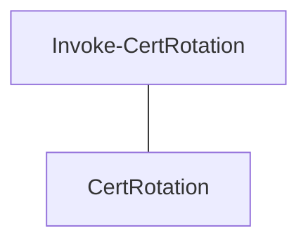

<!-- GENERATED by docs-warden - do not edit -->

# Domain model

Generated by `domain_model.py` from 128 source file(s) (python, javascript, powershell). Categories come
from a naming heuristic (`references/concept-categories.md`); a concept in the wrong table is
fixed by renaming it in code or listing it under `ontology.overrides:` in `.docs-warden.yml`,
never by editing this file.

## Domain concepts

| Concept | Kind | Defined in | Summary | Documented in |
|---------|------|------------|---------|---------------|
| CertRotation | noun | `plugins/docs-warden/test/fixtures/repo-it-tooling/src/CertRotate.psm1:2` |  |  |
| Ontology | class | `plugins/docs-warden/skills/ontological-documentation/scripts/extract_concepts.py:84` | Concepts and candidate edges. Edges are filtered at the end, not as they |  |

## Technical concepts

| Concept | Kind | Defined in |
|---------|------|------------|
| Invoke-CertRotation | function | `plugins/docs-warden/test/fixtures/repo-it-tooling/src/CertRotate.psm1:2` |
| ResolutionError | class | `plugins/fabflows/evals/fixtures/dep-resolver/reference/src/index.js:184` |
| _artifact_label | function | `plugins/docs-warden/skills/docs-warden/scripts/audit.py:886` |
| _artifact_paths | function | `plugins/docs-warden/test/test_scripts.py:409` |
| _artifact_present | function | `plugins/docs-warden/skills/docs-warden/scripts/audit.py:877` |
| _artifact_satisfied | function | `plugins/docs-warden/skills/docs-warden/scripts/audit.py:891` |
| _audit_check | function | `plugins/docs-warden/test/test_scripts.py:97` |
| _candidate_files | function | `plugins/docs-warden/skills/ontological-documentation/scripts/extract_concepts.py:300` |
| _cell | function | `plugins/docs-warden/skills/ontological-documentation/scripts/domain_model.py:84` |
| _documentation_files | function | `plugins/docs-warden/skills/docs-warden/scripts/audit.py:569` |
| _domain_model | function | `plugins/docs-warden/test/test_scripts.py:1799` |
| _extract | function | `plugins/docs-warden/test/test_scripts.py:1742` |
| _first_line | function | `plugins/docs-warden/skills/ontological-documentation/scripts/extract_concepts.py:65` |
| _full_card | function | `plugins/docs-warden/test/test_scripts.py:739` |
| _has_edge | function | `plugins/docs-warden/test/test_scripts.py:1750` |
| _import_audit | function | `plugins/docs-warden/test/test_scripts.py:1627` |
| _is_example_asset | function | `plugins/docs-warden/skills/docs-warden/scripts/audit.py:582` |
| _is_package_runner | function | `plugins/docs-warden/skills/docs-warden/scripts/audit.py:424` |
| _js | function | `plugins/docs-warden/skills/ontological-documentation/scripts/extract_concepts.py:166` |
| _line_of | function | `plugins/docs-warden/skills/ontological-documentation/scripts/extract_concepts.py:162` |
| _lint_entry | function | `plugins/docs-warden/test/test_scripts.py:1252` |
| _lint_runner | function | `plugins/docs-warden/skills/docs-warden/scripts/audit.py:684` |
| _make_unreadable | function | `plugins/docs-warden/test/test_scripts.py:817` |
| _names | function | `plugins/docs-warden/skills/ontological-documentation/scripts/extract_concepts.py:194` |
| _node | function | `plugins/docs-warden/skills/ontological-documentation/scripts/domain_model.py:88` |
| _one_check | function | `plugins/docs-warden/test/test_scripts.py:88` |
| _only_note | function | `plugins/docs-warden/skills/docs-warden/scripts/audit.py:87` |
| _ontology_audit_repo | function | `plugins/docs-warden/test/test_scripts.py:1847` |
| _ontology_repo | function | `plugins/docs-warden/test/test_scripts.py:1715` |
| _param_candidates | function | `plugins/docs-warden/skills/ontological-documentation/scripts/extract_concepts.py:75` |
| _powershell | function | `plugins/docs-warden/skills/ontological-documentation/scripts/extract_concepts.py:217` |
| _ps_synopsis | function | `plugins/docs-warden/skills/ontological-documentation/scripts/extract_concepts.py:208` |
| _python | function | `plugins/docs-warden/skills/ontological-documentation/scripts/extract_concepts.py:124` |
| _regulated_repo | function | `plugins/docs-warden/test/test_scripts.py:1053` |
| _relative_link_targets | function | `plugins/docs-warden/skills/docs-warden/scripts/audit.py:587` |
| _resolve_standard | function | `plugins/docs-warden/skills/docs-warden/scripts/audit.py:913` |
| _rule_qms_record | function | `plugins/docs-warden/skills/docs-warden/scripts/audit.py:818` |
| _rule_trace_requirements | function | `plugins/docs-warden/skills/docs-warden/scripts/audit.py:842` |
| _runlog_warnings | function | `plugins/docs-warden/test/test_scripts.py:283` |
| _shown | function | `plugins/docs-warden/skills/docs-warden/scripts/audit.py:397` |
| _snake_to_pascal | function | `plugins/docs-warden/skills/ontological-documentation/scripts/extract_concepts.py:71` |
| _standards_entries | function | `plugins/docs-warden/test/test_scripts.py:1400` |
| _standards_entry | function | `plugins/docs-warden/test/test_scripts.py:1418` |
| _standards_label | function | `plugins/docs-warden/skills/docs-warden/scripts/audit.py:1145` |
| _table | function | `plugins/docs-warden/test/test_scripts.py:399` |
| _terraform | function | `plugins/docs-warden/skills/ontological-documentation/scripts/extract_concepts.py:262` |
| _terraform_edges | function | `plugins/docs-warden/skills/ontological-documentation/scripts/extract_concepts.py:282` |
| _tf_body | function | `plugins/docs-warden/skills/ontological-documentation/scripts/extract_concepts.py:247` |
| _universal_repo | function | `plugins/docs-warden/test/test_scripts.py:143` |
| _unread_note | function | `plugins/docs-warden/skills/docs-warden/scripts/audit.py:92` |
| _waivable | function | `plugins/docs-warden/skills/docs-warden/scripts/audit.py:115` |
| _waive | function | `plugins/docs-warden/skills/docs-warden/scripts/audit.py:1120` |
| all_costs | function | `plugins/fabflows/evals/harness/annotate_benchmark.py:68` |
| apply_overrides | function | `plugins/docs-warden/skills/ontological-documentation/scripts/domain_model.py:69` |
| audit | function | `plugins/docs-warden/skills/docs-warden/scripts/audit.py:1086` |
| build | function | `plugins/docs-warden/skills/ontological-documentation/scripts/domain_model.py:141` |
| canonical | function | `plugins/docs-warden/skills/docs-warden/scripts/trace_matrix.py:42` |
| categorise | function | `plugins/docs-warden/skills/ontological-documentation/scripts/extract_concepts.py:55` |
| check | function | `plugins/docs-warden/skills/docs-warden/scripts/audit.py:79` |
| check_front_matter | function | `plugins/docs-warden/skills/docs-warden/scripts/audit.py:258` |
| check_generated_docs | function | `plugins/docs-warden/skills/docs-warden/scripts/audit.py:438` |
| check_glossary_reject_terms | function | `plugins/docs-warden/skills/docs-warden/scripts/audit.py:743` |
| check_legacy_decisions | function | `plugins/docs-warden/skills/docs-warden/scripts/audit.py:319` |
| check_links | function | `plugins/docs-warden/skills/docs-warden/scripts/audit.py:601` |
| check_lint | function | `plugins/docs-warden/skills/docs-warden/scripts/audit.py:694` |
| check_manifest | function | `plugins/docs-warden/skills/docs-warden/scripts/audit.py:139` |
| check_ontology | function | `plugins/docs-warden/skills/docs-warden/scripts/audit.py:331` |
| check_phi_secrets | function | `plugins/docs-warden/skills/docs-warden/scripts/audit.py:790` |
| check_readme_shape | function | `plugins/docs-warden/skills/docs-warden/scripts/audit.py:1020` |
| check_required_files | function | `plugins/docs-warden/skills/docs-warden/scripts/audit.py:205` |
| check_standards | function | `plugins/docs-warden/skills/docs-warden/scripts/audit.py:946` |
| documented_in | function | `plugins/docs-warden/skills/ontological-documentation/scripts/domain_model.py:45` |
| dollars | function | `plugins/fabflows/evals/harness/annotate_benchmark.py:84` |
| extract | function | `plugins/docs-warden/skills/ontological-documentation/scripts/extract_concepts.py:325` |
| git | function | `plugins/docs-warden/skills/docs-warden/scripts/_common.py:238` |
| is_git_repo | function | `plugins/docs-warden/skills/docs-warden/scripts/_common.py:256` |
| is_test | function | `plugins/docs-warden/skills/docs-warden/scripts/trace_matrix.py:54` |
| last_commit_epoch | function | `plugins/docs-warden/skills/docs-warden/scripts/freshness.py:89` |
| load_config | function | `plugins/docs-warden/skills/docs-warden/scripts/_common.py:146` |
| long_lived_docs | function | `plugins/docs-warden/skills/docs-warden/scripts/_common.py:215` |
| main | function | `plugins/docs-warden/skills/docs-warden/scripts/audit.py:1187` |
| markdown_docs | function | `plugins/docs-warden/skills/docs-warden/scripts/_common.py:260` |
| mean_gradient | function | `plugins/docs-warden/test/fixtures/repo-regulated/src/pressure.py:4` |
| overrides_from | function | `plugins/docs-warden/skills/ontological-documentation/scripts/domain_model.py:59` |
| parse_domain_model | function | `plugins/docs-warden/skills/docs-warden/scripts/_common.py:193` |
| parse_front_matter | function | `plugins/docs-warden/skills/docs-warden/scripts/_common.py:98` |
| parse_glossary | function | `plugins/docs-warden/skills/docs-warden/scripts/_common.py:161` |
| read_doc | function | `plugins/docs-warden/skills/docs-warden/scripts/_common.py:77` |
| read_front_matter | function | `plugins/docs-warden/skills/docs-warden/scripts/_common.py:115` |
| render | function | `plugins/docs-warden/skills/ontological-documentation/scripts/domain_model.py:106` |
| render_aggregate | function | `plugins/docs-warden/skills/docs-warden/scripts/audit.py:1172` |
| render_graph | function | `plugins/docs-warden/skills/ontological-documentation/scripts/domain_model.py:93` |
| render_single | function | `plugins/docs-warden/skills/docs-warden/scripts/audit.py:1159` |
| required_files | function | `plugins/docs-warden/skills/docs-warden/scripts/archetypes.py:20` |
| review_date | function | `plugins/docs-warden/skills/docs-warden/scripts/_common.py:126` |
| runlog_entries | function | `plugins/docs-warden/skills/docs-warden/scripts/freshness.py:45` |
| runlog_shape_warnings | function | `plugins/docs-warden/skills/docs-warden/scripts/freshness.py:59` |
| shared_diff | function | `plugins/fabflows/evals/harness/annotate_benchmark.py:72` |
| source_files | function | `plugins/docs-warden/skills/ontological-documentation/scripts/extract_concepts.py:314` |
| stats | function | `plugins/fabflows/evals/harness/annotate_benchmark.py:59` |
| strip_code | function | `plugins/docs-warden/skills/docs-warden/scripts/_common.py:274` |
| test_REQ_FIX_001_rejects_empty_snapshot | function | `plugins/docs-warden/test/fixtures/repo-regulated/tests/test_pressure.py:13` |
| test_REQ_FIX_003_rounds_to_one_decimal | function | `plugins/docs-warden/test/fixtures/repo-regulated/tests/test_pressure.py:18` |
| test_a_bare_manifest_key_means_the_default_not_a_wrong_type | function | `plugins/docs-warden/test/test_scripts.py:527` |
| test_a_gitlab_repo_is_not_failed_for_having_no_dot_github | function | `plugins/docs-warden/test/test_scripts.py:196` |
| test_a_known_archetype_still_demands_its_own_documents | function | `plugins/docs-warden/test/test_scripts.py:128` |
| test_a_legacy_decisions_folder_is_skipped_but_still_scanned_and_flagged | function | `plugins/docs-warden/test/test_scripts.py:247` |
| test_a_missing_ontology_generator_is_a_failure_not_a_skip | function | `plugins/docs-warden/test/test_scripts.py:543` |
| test_a_real_shared_artifact_names_its_co_claimant_in_both_rows | function | `plugins/docs-warden/test/test_scripts.py:1533` |
| test_a_repository_can_add_a_requirement_of_its_own | function | `plugins/docs-warden/test/test_scripts.py:510` |
| test_a_review_date_beyond_the_cadence_is_reported | function | `plugins/docs-warden/test/test_scripts.py:364` |
| test_a_shared_artifact_is_named_in_every_row_that_wants_it | function | `plugins/docs-warden/test/test_scripts.py:1464` |
| test_a_standard_with_a_broken_entry_is_not_named_as_a_co_claimant | function | `plugins/docs-warden/test/test_scripts.py:1587` |
| test_a_stray_runlog_gets_one_warning_and_no_rotation_warning | function | `plugins/docs-warden/test/test_scripts.py:329` |
| test_a_waiver_for_a_check_that_does_not_exist_is_reported | function | `plugins/docs-warden/test/test_scripts.py:602` |
| test_a_waiver_keeps_the_finding_visible_and_is_not_a_pass | function | `plugins/docs-warden/test/test_scripts.py:560` |
| test_a_waiver_naming_a_standard_that_does_not_exist_is_reported | function | `plugins/docs-warden/test/test_scripts.py:615` |
| test_a_waiver_without_a_reason_is_rejected | function | `plugins/docs-warden/test/test_scripts.py:587` |
| test_an_empty_required_directory_is_not_a_present_document | function | `plugins/docs-warden/test/test_scripts.py:176` |
| test_an_unknown_forge_fails_rather_than_requiring_nothing | function | `plugins/docs-warden/test/test_scripts.py:219` |
| test_audit_fails_a_generator_that_never_writes_its_declared_path | function | `plugins/docs-warden/test/test_scripts.py:1102` |
| test_audit_reports_a_failing_generator_instead_of_in_sync | function | `plugins/docs-warden/test/test_scripts.py:55` |
| test_audit_reports_a_failing_trace_matrix_instead_of_every_requirement_tested | function | `plugins/docs-warden/test/test_scripts.py:1076` |
| test_audit_reports_a_malformed_generated_docs_instead_of_crashing | function | `plugins/docs-warden/test/test_scripts.py:751` |
| test_audit_reports_an_unknown_archetype_instead_of_passing | function | `plugins/docs-warden/test/test_scripts.py:108` |
| test_audit_survives_a_document_it_cannot_read | function | `plugins/docs-warden/test/test_scripts.py:850` |
| test_audit_survives_a_document_that_is_not_valid_utf8 | function | `plugins/docs-warden/test/test_scripts.py:791` |
| test_concept_categories_reference_matches_the_code | function | `plugins/docs-warden/test/test_scripts.py:1831` |
| test_documents_are_found_when_the_repo_itself_lives_under_a_skipped_directory | function | `plugins/docs-warden/test/test_scripts.py:684` |
| test_domain_model_is_idempotent_and_check_detects_a_hand_edit | function | `plugins/docs-warden/test/test_scripts.py:1805` |
| test_each_audited_repo_gets_its_own_scorecard | function | `plugins/docs-warden/test/test_scripts.py:952` |
| test_every_check_id_is_declared_once | function | `plugins/docs-warden/test/test_scripts.py:494` |
| test_every_standard_reference_marks_what_it_does_not_check | function | `plugins/docs-warden/test/test_scripts.py:454` |
| test_extractor_reads_all_four_languages_and_categorises_by_name | function | `plugins/docs-warden/test/test_scripts.py:1754` |
| test_extractor_says_so_instead_of_reporting_an_empty_repo | function | `plugins/docs-warden/test/test_scripts.py:1786` |
| test_freshness_reports_a_list_valued_archetype_instead_of_crashing | function | `plugins/docs-warden/test/test_scripts.py:342` |
| test_freshness_skips_the_runlog_checks_without_a_manifest | function | `plugins/docs-warden/test/test_scripts.py:355` |
| test_freshness_warns_on_a_runlog_entry_of_the_wrong_shape | function | `plugins/docs-warden/test/test_scripts.py:302` |
| test_generated_docs_confines_the_declared_path_to_the_repo | function | `plugins/docs-warden/test/test_scripts.py:1122` |
| test_glossary_to_vale_writes_the_swap_rule_for_a_rejected_term | function | `plugins/docs-warden/test/test_scripts.py:1025` |
| test_links_fails_on_a_dangling_relative_link_and_passes_once_it_resolves | function | `plugins/docs-warden/test/test_scripts.py:1163` |
| test_links_ignores_anchors_and_external_urls | function | `plugins/docs-warden/test/test_scripts.py:1201` |
| test_links_ignores_targets_inside_code_fences | function | `plugins/docs-warden/test/test_scripts.py:1187` |
| test_links_ignores_untracked_and_ignored_markdown_in_a_git_repo | function | `plugins/docs-warden/test/test_scripts.py:1231` |
| test_links_skips_shipped_example_assets | function | `plugins/docs-warden/test/test_scripts.py:1215` |
| test_lint_fails_when_a_blocking_tool_reports_findings | function | `plugins/docs-warden/test/test_scripts.py:1275` |
| test_lint_names_the_install_for_an_adopted_but_missing_tool | function | `plugins/docs-warden/test/test_scripts.py:1337` |
| test_lint_never_downloads_through_a_package_runner | function | `plugins/docs-warden/test/test_scripts.py:1655` |
| test_lint_never_reports_a_bare_pass_when_a_tool_was_absent | function | `plugins/docs-warden/test/test_scripts.py:1304` |
| test_lint_only_warns_when_vale_alone_reports_findings | function | `plugins/docs-warden/test/test_scripts.py:1291` |
| test_lint_reports_skipped_and_says_how_to_unskip_when_nothing_is_adopted | function | `plugins/docs-warden/test/test_scripts.py:1321` |
| test_lint_runner_resolves_the_tool_instead_of_returning_a_bare_name | function | `plugins/docs-warden/test/test_scripts.py:1631` |
| test_lint_survives_a_tool_that_writes_non_utf8_output | function | `plugins/docs-warden/test/test_scripts.py:1351` |
| test_matrix_links_are_relative_to_the_matrix | function | `plugins/docs-warden/test/test_scripts.py:24` |
| test_ontology_check_reports_missing_stale_untagged_and_current | function | `plugins/docs-warden/test/test_scripts.py:1860` |
| test_ontology_overrides_drop_a_concept_and_a_bad_value_fails_the_manifest | function | `plugins/docs-warden/test/test_scripts.py:1895` |
| test_required_files_names_what_the_archetype_declares_but_cannot_check | function | `plugins/docs-warden/test/test_scripts.py:662` |
| test_required_files_passes_without_a_decisions_index | function | `plugins/docs-warden/test/test_scripts.py:238` |
| test_review_by_may_carry_a_time_without_killing_the_run | function | `plugins/docs-warden/test/test_scripts.py:895` |
| test_run_generators_skips_a_package_runner | function | `plugins/docs-warden/test/test_scripts.py:1683` |
| test_runlog_is_required_only_by_the_operational_archetypes | function | `plugins/docs-warden/test/test_scripts.py:270` |
| test_standards_accepts_an_integer_level | function | `plugins/docs-warden/test/test_scripts.py:1425` |
| test_standards_accepts_any_spelling_of_an_alternative_artifact | function | `plugins/docs-warden/test/test_scripts.py:1513` |
| test_standards_fix_points_at_whichever_file_is_actually_wrong | function | `plugins/docs-warden/test/test_scripts.py:1610` |
| test_standards_rejects_a_bare_true_where_a_level_is_required | function | `plugins/docs-warden/test/test_scripts.py:1446` |
| test_standards_rejects_a_level_on_a_standard_that_has_none | function | `plugins/docs-warden/test/test_scripts.py:1439` |
| test_standards_rejects_an_unknown_id | function | `plugins/docs-warden/test/test_scripts.py:1457` |
| test_standards_reports_a_malformed_table_entry_instead_of_crashing | function | `plugins/docs-warden/test/test_scripts.py:1566` |
| test_standards_reports_a_non_mapping_instead_of_crashing | function | `plugins/docs-warden/test/test_scripts.py:1545` |
| test_standards_runs_extra_rules_only_for_the_standard_that_declares_them | function | `plugins/docs-warden/test/test_scripts.py:1488` |
| test_the_audit_and_the_generator_read_one_glossary_the_same_way | function | `plugins/docs-warden/test/test_scripts.py:924` |
| test_the_fixtures_still_report_what_they_were_built_to_report | function | `plugins/docs-warden/test/test_scripts.py:993` |
| test_the_manifest_check_cannot_waive_itself | function | `plugins/docs-warden/test/test_scripts.py:633` |
| test_the_shipped_archetype_table_is_well_formed | function | `plugins/docs-warden/test/test_scripts.py:473` |
| test_the_shipped_standards_table_is_well_formed | function | `plugins/docs-warden/test/test_scripts.py:414` |
| test_trace_matrix_reads_the_tree_when_the_repo_lives_under_a_skipped_directory | function | `plugins/docs-warden/test/test_scripts.py:713` |
| test_waiving_the_standards_family_covers_each_declared_standard | function | `plugins/docs-warden/test/test_scripts.py:646` |

## Relationships

```mermaid
graph TD
    Invoke_CertRotation["Invoke-CertRotation"] --- CertRotation
```
