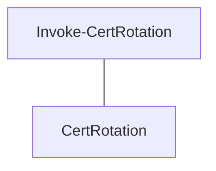

<!-- GENERATED by docs-warden - do not edit -->

# Domain model

Generated by `domain_model.py` from 1 source file (powershell). Categories come
from a naming heuristic (`references/concept-categories.md`); a concept in the wrong table is
fixed by renaming it in code or listing it under `ontology.overrides:` in `.docs-warden.yml`,
never by editing this file.

## Domain concepts

| Concept | Kind | Defined in | Summary | Documented in |
|---------|------|------------|---------|---------------|
| CertRotation | noun | `src/CertRotate.psm1:2` |  | `docs/runbook.md` |

## Technical concepts

| Concept | Kind | Defined in |
|---------|------|------------|
| Invoke-CertRotation | function | `src/CertRotate.psm1:2` |

## Relationships

